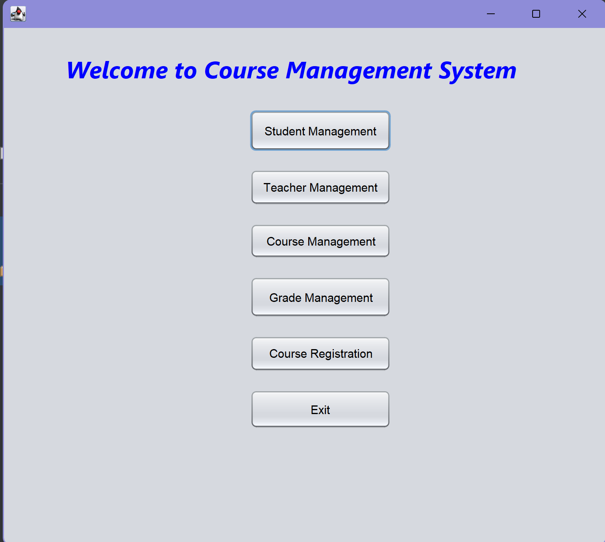
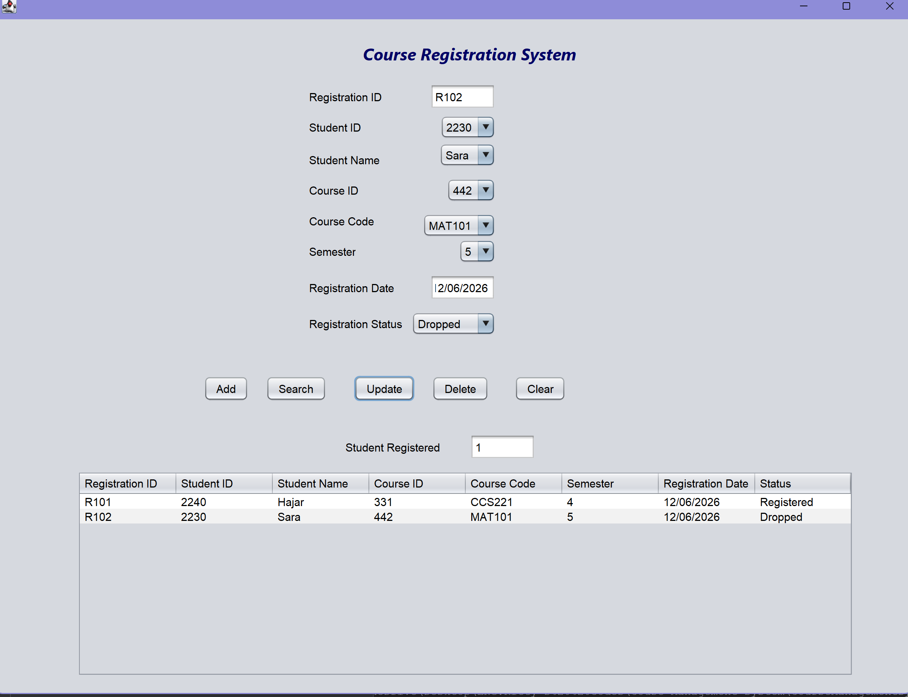

# 📚 Course Registration Management System

A desktop application developed using **Java Swing** for managing student course registrations. The system allows users to register students in available courses, update and delete registrations, search records, and store data using Java Object Serialization.

> **This project was developed as part of a university group project.**

---

# 👥 My Contribution

As a member of the development team, I was responsible for designing and implementing the **Course Registration Module**.

My responsibilities included:

- Designing the `Registration` class using Object-Oriented Programming (OOP).
- Implementing the `RegistrationManagement` class to handle the registration business logic.
- Developing the `RegistrationGui` using Java Swing.
- Implementing CRUD operations:
  - Add Registration
  - Search Registration
  - Update Registration
  - Delete Registration
- Implementing validation rules:
  - Prevent duplicate registrations for the same student in the same course.
  - Verify that the course is offered before registration.
  - Check course capacity before allowing registration.
- Synchronizing:
  - Student ID ↔ Student Name
  - Student ID → Semester
  - Course ID ↔ Course Code
- Saving and loading registration records using Java Object Serialization.
- Displaying registration records using JTable.
- Implementing confirmation dialogs and exception handling to improve user experience.

---

# ✨ Features

- Add new course registrations
- Search registrations by Registration ID
- Search registrations by Student ID
- Update registration information
- Delete registrations
- Display registrations in a JTable
- Automatic synchronization between student and course information
- Display registered student count for each course
- Save and load data using Java Object Serialization

---

# ✅ Validation

- Prevent duplicate course registrations
- Course availability validation
- Maximum course capacity validation
- Delete confirmation
- Clear confirmation
- Exception handling for invalid input

---

# 🛠 Technologies Used

- Java
- Java Swing
- Object-Oriented Programming (OOP)
- Maven
- NetBeans IDE
- ArrayList
- File Handling
- Object Serialization

---

# 📂 Project Structure

```text
src/
│
├── courseregistration/
│   ├── Registration.java
│   ├── RegistrationManagement.java
│   ├── RegistrationGui.java
│   └── Helpers.java
│
├── studentmanagement/
├── coursemanagement/
```

---

# 📸 Screenshots

### Main Menu



### Course Registration Interface



---

# 👩‍💻 Credits

This project was completed as a **university group project**.

This repository highlights **my individual contribution** to the **Course Registration Module**.

Developed and maintained by **Hajar Alhajri**.
